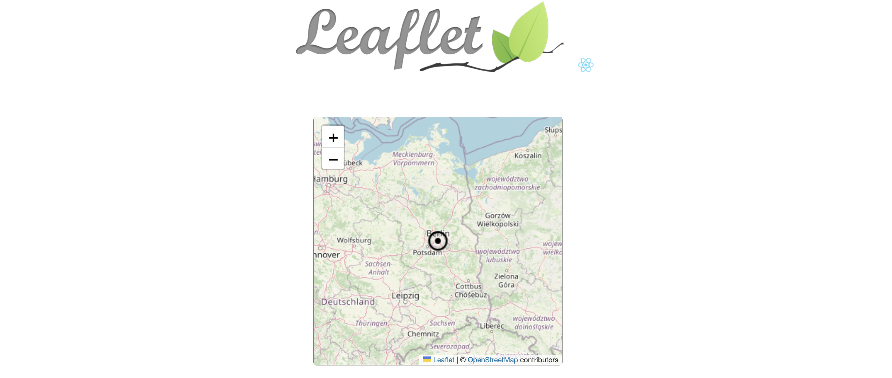

## Setting up a basic leaflets.js map in React
### View Project
This demo project has been built with Create-React-App environment. To view it in browser, fork and clone it, and run `npm start` from project root directory.


### Leaflet Setup
1. Install leaflet and react-leaflet with `npm install react-leaflet leaflet`.

2. Import core components with `import { MapContainer, TileLayer, Marker, Popup } from 'react-leaflet'` and `import { Icon } from 'leaflet'` (*see code in [Map.js](https://github.com/ms-aija/LeafletReact5minDemo/blob/master/client/src/components/Map.js#L2) component*).

3. Add leaflet stylesheet to the component with `import 'leaflet/dist/leaflet.css'` (*see code in [Map.js](./client/src/components/Map.js) component and [leaflet.js docs](https://leafletjs.com/examples/quick-start/)*).
```
<link rel="stylesheet" href="https://unpkg.com/leaflet@1.8.0/dist/leaflet.css"
  integrity="sha512-hoalWLoI8r4UszCkZ5kL8vayOGVae1oxXe/2A4AO6J9+580uKHDO3JdHb7NzwwzK5xr/Fs0W40kiNHxM9vyTtQ=="
  crossorigin="" />
```

4. Add `.leaflet-container` class to css with map dimensions (other properties are optional). Note that the class **does not** have to added anywhere in the map component itself. (*see code in [index.css](./client//src/index.css)*).
```
.leaflet-container {
  width: 350px;
  height: 350px;
}
```

5. Add `MapContainer` component inside a `div` with id="map" (*see code in [Map.js](./client/src/components/Map.js) component and [react leaflet docs](https://react-leaflet.js.org/)*).
```
 <div className="map" id="map" >
  <MapContainer center={position} zoom={6} scrollWheelZoom={true}>
    <TileLayer
      attribution='&copy; <a href="https://www.openstreetmap.org/copyright">OpenStreetMap</a> contributors'
      url="https://{s}.tile.openstreetmap.org/{z}/{x}/{y}.png"
    />
    <Marker position={position}>
      <Popup>
        🐻🍻🎉
      </Popup>
    </Marker>
  </MapContainer>
<div/>
```
Note, I have defined the [position](https://github.com/ms-aija/LeafletReact5minDemo/blob/master/client/src/components/Map.js#L8) as a variable outside inside the component but outside the `return` statement.
```
const position = [52.51, 13.38]
```

#### Optional

6. Create a custom marker by defining a new instance of `Icon` outside the `return` statement (note, there are additional properties that can be defined for the icon)
```
const customIcon = new Icon({
    iconUrl: "/icons8-select-24.png",
    iconSize: [33, 33]
  })
```
and add `icon` property to `Marker` component.
```
<Marker position={position} icon={customIcon}>
```
(*see code in [Map.js](./client/src/components/Map.js) component*)


7. Add custom tiles by updating `attribution` and `url` properties in `TileLayer` component (*see code in [Map.js](./client/src/components/Map.js) component*).
* You can find some tile options from [leaflet extras](https://leaflet-extras.github.io/leaflet-providers/preview/). To update your project with one of the options simply copy attribution and url. For example, to include the Stadia.AlidadeSmoothDark map:
```
 <TileLayer
  attribution='&copy; <a href="https://stadiamaps.com/">Stadia Maps</a>, &copy; <a href="https://openmaptiles.org/">OpenMapTiles</a> &copy; <a href="http://openstreetmap.org">OpenStreetMap</a> contributors'
  url='https://tiles.stadiamaps.com/tiles/alidade_smooth_dark/{z}/{x}/{y}{r}.png'
/>
```

*And watch [The Billion Dollar Code](https://www.imdb.com/title/tt15392100/) to learn about tiles with some entertainment value* 😉🙃

---

